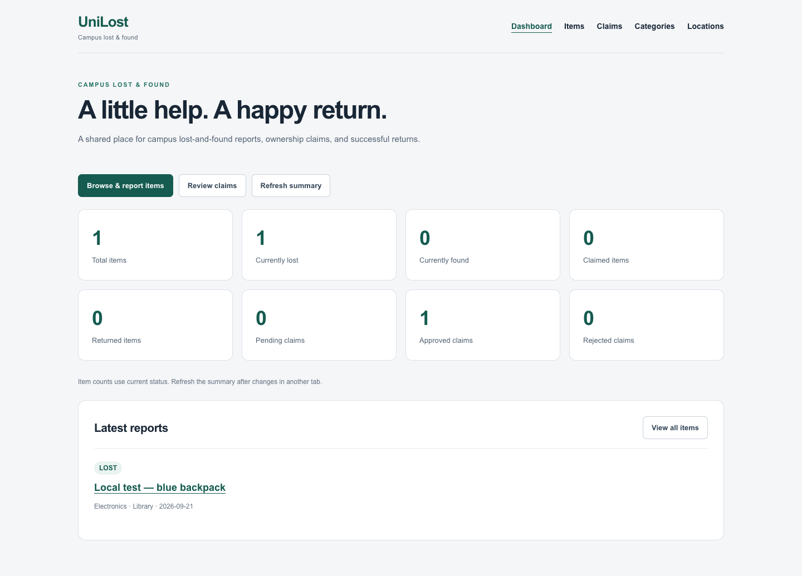
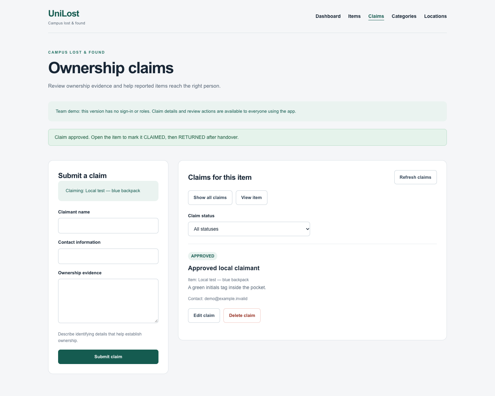
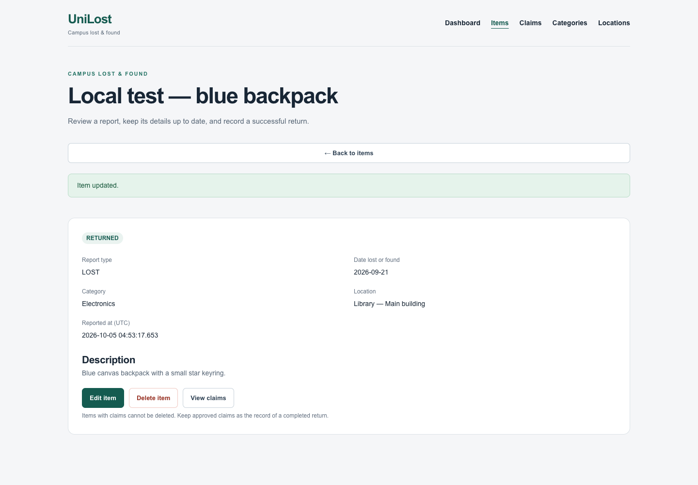

# UniLost — Campus Lost & Found

UniLost lets a campus community report lost and found items, search reports, submit ownership evidence, review claims, and record returned property. It uses Next.js App Router, TypeScript and MongoDB.

## Team responsibilities

| Member | Primary contribution |
| --- | --- |
| Myo Kyi Sim Thar | MongoDB connection, Category CRUD, Location CRUD, VM deployment |
| Myat Zay Hein | Item CRUD, Claim CRUD, dashboard, Item search/filtering, contribution documentation |
| Both | Shared architecture, integration review, screenshots and demo preparation |

See [PROJECT.md](PROJECT.md) for the agreed schema and scope. Implementation and verification of the Item/Claim contribution were prepared with AI assistance; this does not represent independently logged personal working hours.

## Features

- **Items:** report, list, inspect, edit and delete reports; choose real Categories and Locations; filter by text, type, status, Category and Location; pagination.
- **Claims:** submit evidence and contact details, list/read/edit/delete claims, approve or reject, filter by status and Item. Only one claim per Item can be approved.
- **Returns:** after approving evidence, explicitly mark the Item `CLAIMED`, then `RETURNED` after handover.
- **Dashboard:** live Item and Claim counts, latest reports, links to every management area.
- **Integration:** Category/Location APIs from the shared branch are included. Referenced Categories/Locations and Items with Claims cannot be deleted.
- **UI:** responsive pages, validation, loading/error/empty/success messages, retry controls and delete confirmations.

## Run with your MongoDB database

Requirements: Node.js 22.13+ (verified with 24.16), npm, and a MongoDB server supported by the installed driver. Commands below run from the repository root.

```sh
cd unilost-starter
npm ci
cp .env.example .env.local
```

Set `MONGODB_URI` and `MONGODB_DB` in `.env.local`, then:

```sh
npm run dev
```

Open [localhost:3000](http://localhost:3000). Create a Category and Location before reporting an Item. Keep `.env.local` private.

For a production process on the team's VM:

```sh
npm run build
npm start
```

VM provisioning, environment configuration and the final public URL remain the deployment owner's responsibility; no hosted deployment is claimed by this contribution.

## Quick local demo without database setup

From `unilost-starter`:

```sh
npm ci
npm run demo
```

Open [localhost:3217](http://127.0.0.1:3217). This runs the real production app against a disposable local MongoDB with an Electronics Category and Library Location. The database is temporary and is removed when the process stops. The first run may download a MongoDB binary. No team database or `.env.local` credentials are used.

## Verify

Google Chrome is required for the browser checks. From `unilost-starter`:

```sh
npm ci
npm run verify
```

This runs lint, TypeScript, a production build, 96 API/database checks, and 24 browser checks using a disposable local database. Port 3217 must be free; stop the demo first. Successful flows use the real Category, Location, Item, Claim and dashboard APIs. Only failure/loading/empty responses are simulated to test feedback states.

Verified on 5 October 2026: all checks passed. [Verification details and logs](unilost-starter/docs/verification/README.md).

## Submission and demonstration

- [10-part contribution checklist](unilost-starter/docs/submission-checklist.md)
- [Testing guide and API/workflow details](unilost-starter/docs/myat-testing.md)
- [3–4 minute demo script and likely questions](unilost-starter/docs/demo-script.md)
- [Current screenshots](unilost-starter/docs/screenshots/README.md)

The screenshots below are genuine captures of the local production build with labelled test data and real APIs.







## Scope and limitations

Authentication and user roles are explicitly outside the team's approved scope. Management actions and claim contact details are visible to all app users. Item/Claim cross-collection checks follow the existing non-transactional architecture; the unique approval index prevents duplicate approvals, but all cross-collection races are not eliminated. See the testing guide for the precise boundary.
