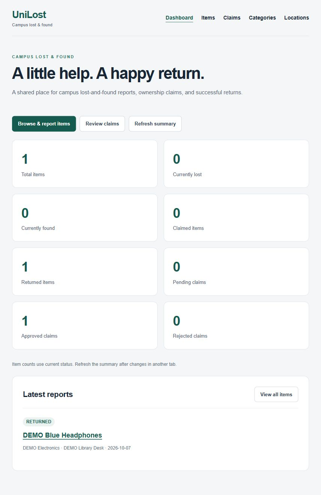

# UniLost

UniLost is our campus lost-and-found project, built with Next.js, TypeScript and MongoDB. Students can report lost or found items, search reports, submit ownership claims and record returns.

**Public demo:** [http://4.217.184.157/](http://4.217.184.157/). The website is available while the Azure VM is running.

## Team responsibilities

| Member | Responsibilities |
| --- | --- |
| Myo Kyi Sim Thar | MongoDB setup, Category and Location CRUD, Azure VM deployment |
| Myat Zay Hein | Item and Claim CRUD, dashboard, search and filters, documentation |

## Main features

- Create, view, edit and delete Categories, Locations, Items and Claims.
- Search Item names and descriptions; filter by type, status, Category and Location.
- Review ownership evidence and approve or reject Claims. Only one Claim per Item can be approved.
- Mark an Item CLAIMED after approval, then RETURNED after handover.
- View dashboard totals and recent reports, with responsive forms and feedback messages.
- Prevent deletion of Categories/Locations used by Items and Items that still have Claims.

## Local setup

Use Node.js 24, npm and a compatible MongoDB server. The saved local run used Node.js 24.16. Commands start from the repository root:

```sh
cd unilost-starter
npm ci
cp .env.example .env.local
```

Copy the environment file only on first setup; keep any existing local settings. The example uses local MongoDB at `127.0.0.1:27017` and database `unilost`. Set `MONGODB_URI` and `MONGODB_DB` for your own database in `.env.local`, and keep that file private.

```sh
npm run dev
```

Open [localhost:3000](http://localhost:3000). Create a Category and Location before reporting an Item. For a production build, use `npm run build` followed by `npm start`.

To try a temporary local database instead, run `npm run demo` from `unilost-starter` and open [localhost:3217](http://127.0.0.1:3217). This uses a disposable MongoDB with a Category and Location already added. It does not use the configured application database, and its records disappear when it stops. The first run may download MongoDB.

## Testing

With dependencies installed, run from `unilost-starter`:

```sh
npm run verify
```

This runs lint, TypeScript, a production build, API/database tests and browser tests. Google Chrome must be installed and port 3217 must be free, so stop the local demo first. Use [the shared testing guide](unilost-starter/docs/testing.md) for individual commands and manual checks.

Saved evidence records 96 API/database and 24 browser checks passing on **5 October 2026**, plus a separate deployed workflow check on **7 October**. These are historical results, not tests rerun during this documentation cleanup.

## Screenshots

These captures show the Azure demo on 7 October 2026 using labelled demo records. The handover was simulated.




[Full screenshot gallery, including the local mobile view](unilost-starter/docs/screenshots/README.md).

## Project guides

- [Project scope, schema and team workflow](PROJECT.md)
- [Shared testing guide and demo walkthrough](unilost-starter/docs/testing.md)
- [Azure deployment and maintenance guide](unilost-starter/docs/deployment.md)
- [Historical verification logs](unilost-starter/docs/verification/README.md)

## Limitations

- The public demo uses HTTP and has no sign-in or roles. Anyone can view Claim contact details and use management actions, so use fictional data for demonstrations.
- Claim approval does not automatically return an Item; the Item status must be updated separately.
- Cross-collection checks do not use transactions. The unique approval index prevents duplicate approved Claims, but some concurrent operations can still race.
- Availability depends on the VM. Exact service configuration and backup arrangements are not recorded in the repository; the deployment guide lists what needs confirming.

The Item/Claim implementation and its saved verification were prepared with AI assistance. The evidence does not represent personal working hours or replace teammate review.
