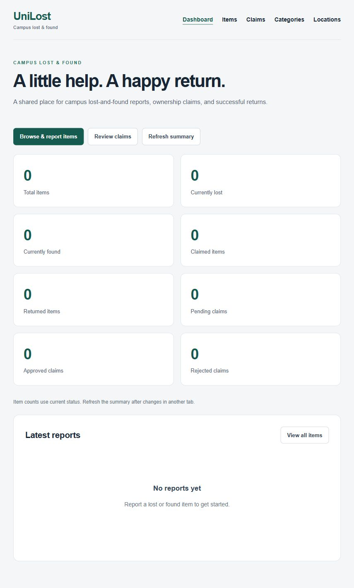
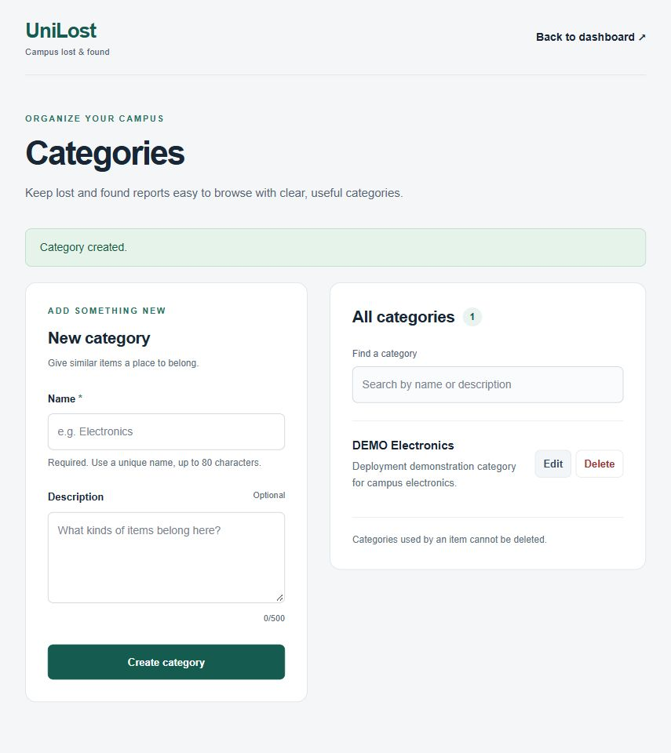
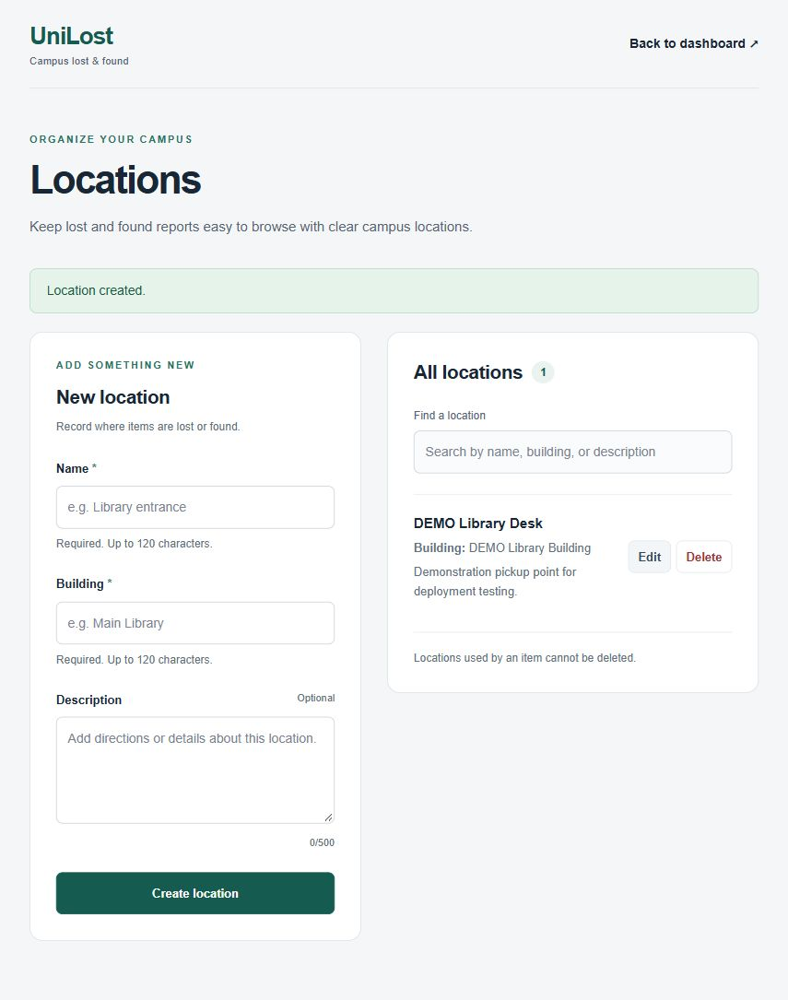
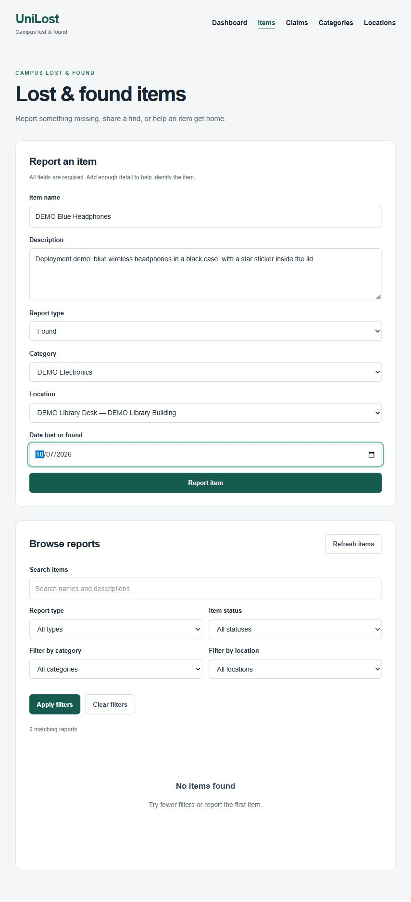
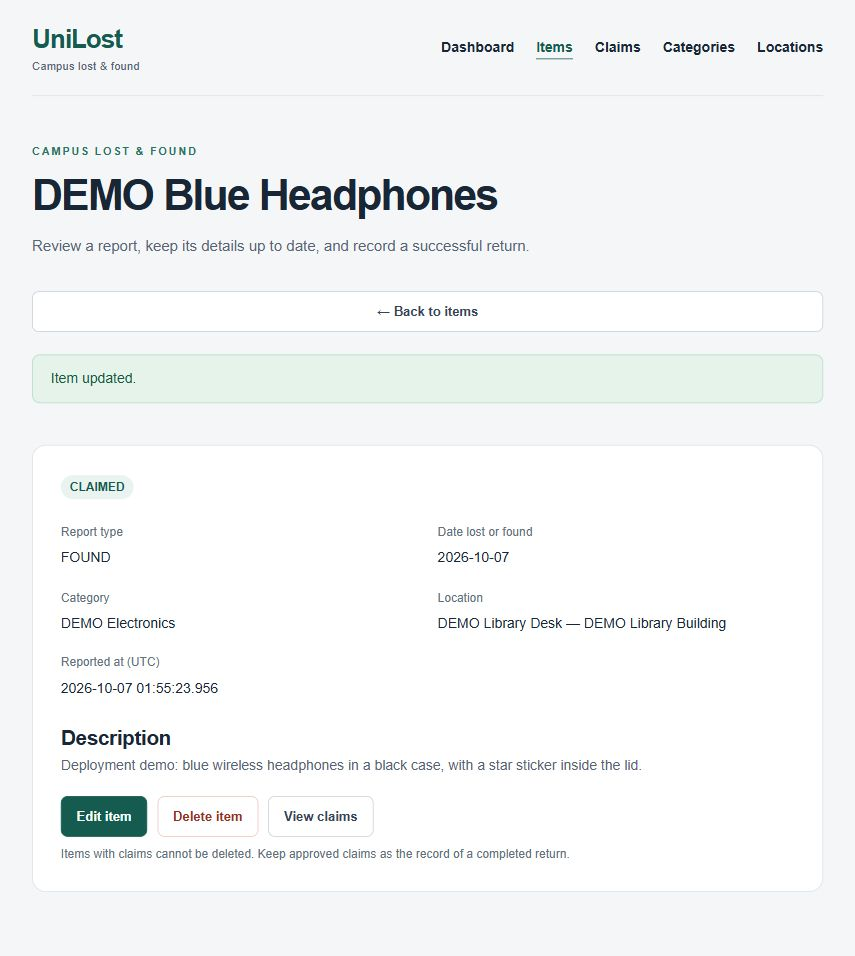
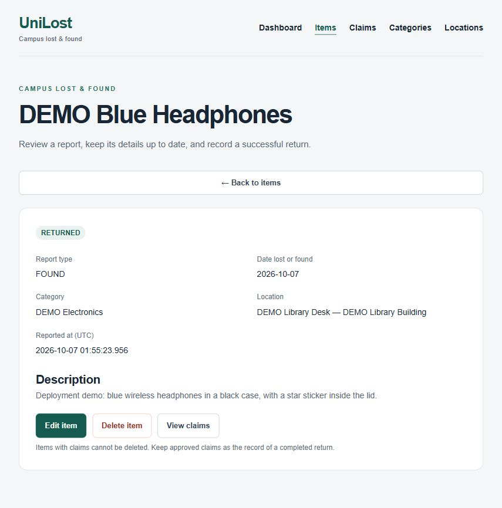
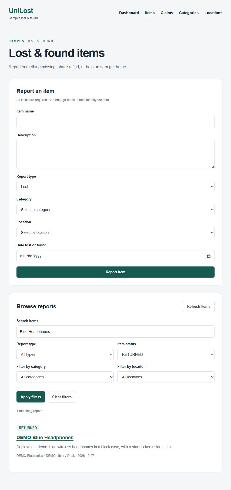

# Azure deployment screenshots

Public URL: [UniLost](http://4.217.184.157/)

Captured on 7 October 2026 from the public Azure deployment in Korea Central. These are real browser screenshots and successful UI/API operations, using clearly labelled DEMO records and a fictional example.com contact. Return/handover was simulated. Records were left available for demonstration.

Checked: Category and Location creation, found Item reporting, Claim submission and approval, explicit CLAIMED → RETURNED changes, reload persistence, text search with status filtering, and dashboard counts. This focused deployed smoke test does not claim the full automated suite was rerun on Azure.

## 1. Empty deployed dashboard before demo records were created.

## 2. Create DEMO Electronics on Categories; success message and saved category.

## 3. Create DEMO Library Desk in DEMO Library Building; success and saved location.

## 4. Complete the found-item form with real Category and Location choices.

## 5. Report submission succeeds and the Item appears in the list.

## 6. Open the Item name to inspect its FOUND status and relationships.

## 7. Enter a demo claimant, fictional test contact, and ownership evidence.

## 8. Submitted Claim starts PENDING.

## 9. Approve the Claim; approval guidance explains the separate Item workflow.

## 10. Item details → Edit item → Status → CLAIMED → Save changes.

## 11. Item status is saved as CLAIMED.

## 12. Edit again → RETURNED → Save changes; status persisted after reloading. Handover was simulated.

## 13. Search Blue Headphones with RETURNED status; one matching report.

## 14. Dashboard shows one total Item, one returned Item, and one approved Claim.

