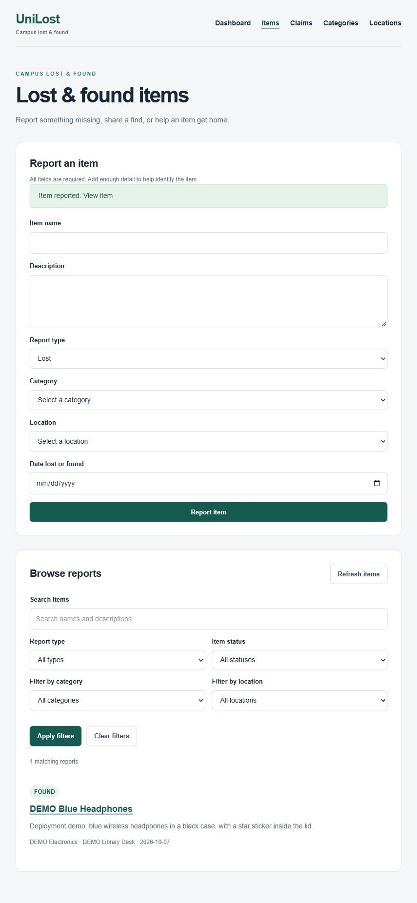
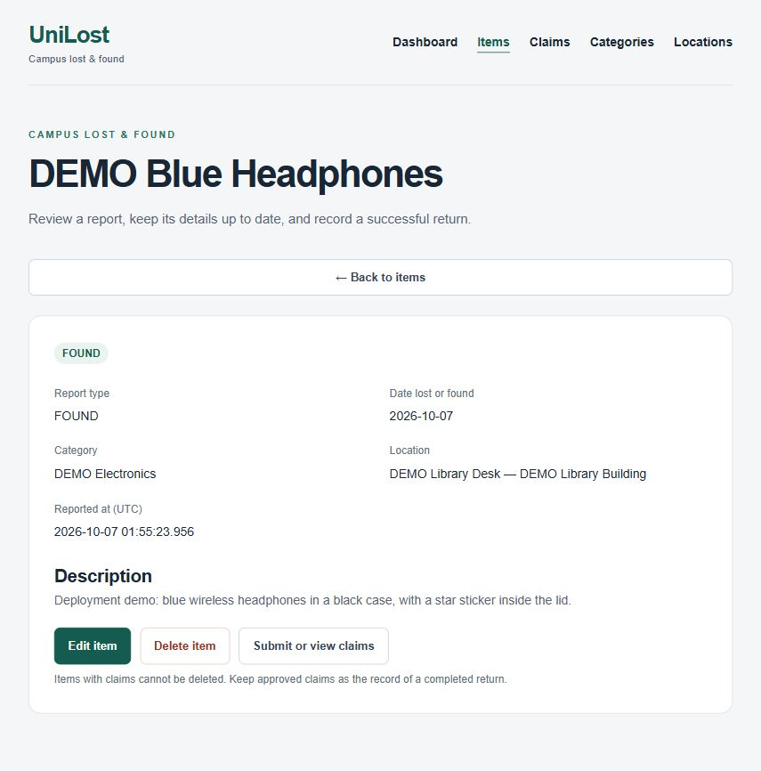
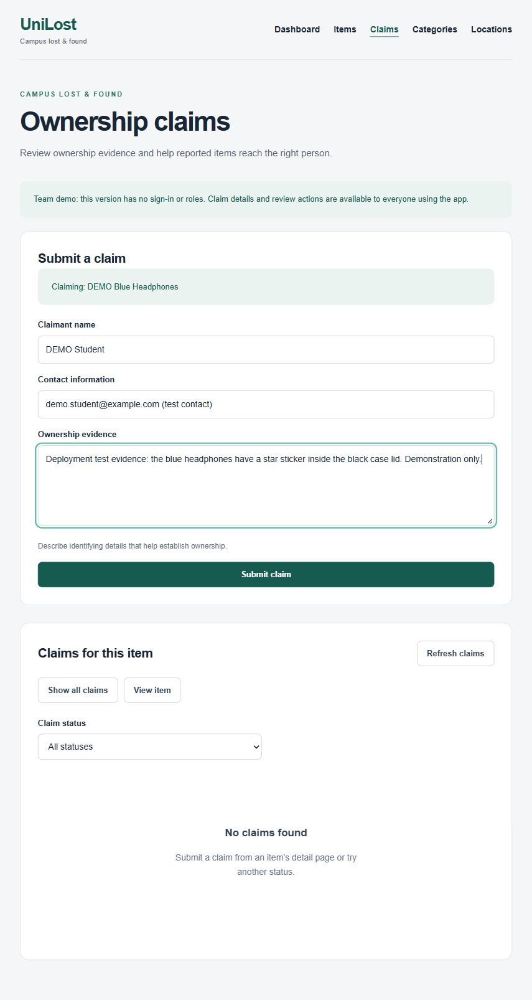
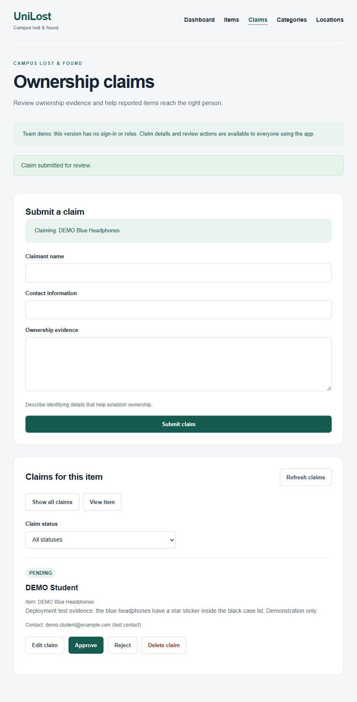
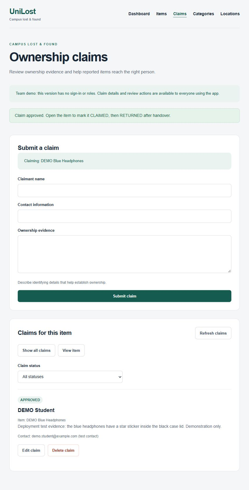
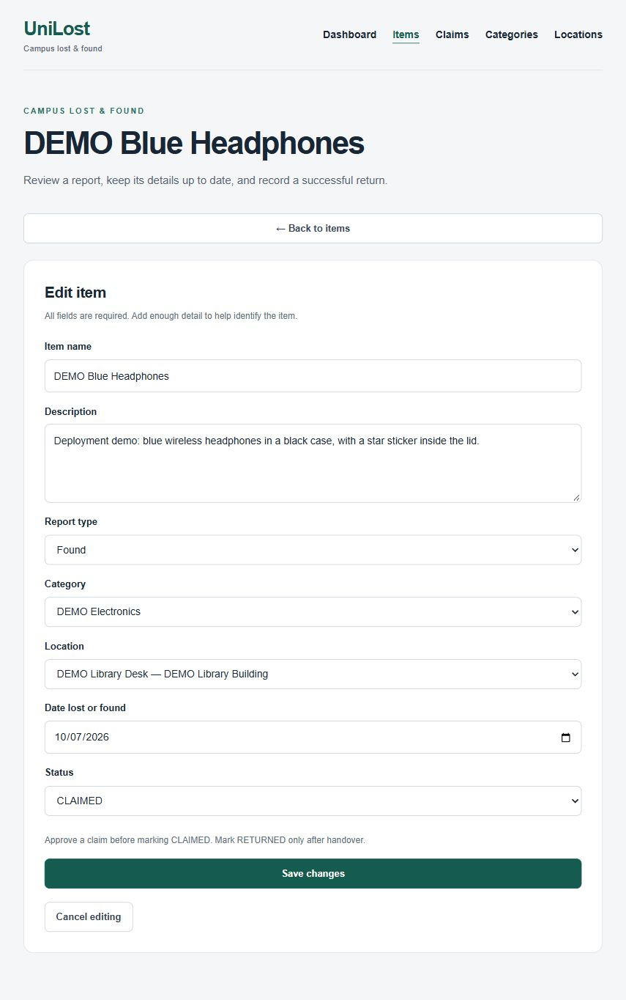
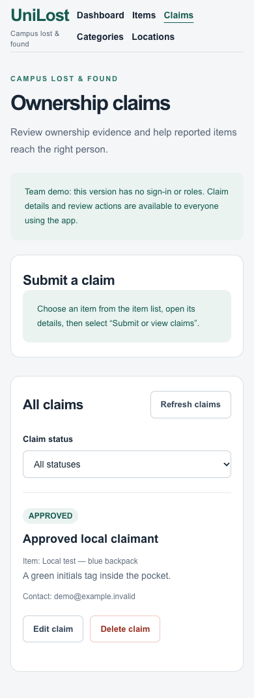

# Screenshot gallery

All screenshots are stored in this folder. The two groups show different runs; neither proves that the site or VM is currently online. Capture dates below come from the original gallery notes, not file modification times.

- [Azure workflow, 7 October 2026](#azure-deployment--7-october-2026)
- [Local verification, 5 October 2026](#local-verification--5-october-2026)
- [Testing guide](../testing.md) · [Deployment guide](../deployment.md)

## Azure deployment — 7 October 2026

Captured from [the public Azure site](http://4.217.184.157/) in Korea Central, according to the saved deployment notes. Records are labelled DEMO and use fictional contact details. The handover was simulated. The original notes record reload persistence as well as the workflow below; they do not claim a full automated suite run on Azure.

### 1. Empty deployed dashboard before demo records were created.

### 2. Create DEMO Electronics on Categories; success message and saved category.

### 3. Create DEMO Library Desk in DEMO Library Building; success and saved location.

### 4. Complete the found-item form with real Category and Location choices.

### 5. Report submission succeeds and the Item appears in the list.

### 6. Open the Item name to inspect its FOUND status and relationships.

### 7. Enter a demo claimant, fictional test contact, and ownership evidence.

### 8. Submitted Claim starts PENDING.

### 9. Approve the Claim; approval guidance explains the separate Item workflow.

### 10. Item details → Edit item → Status → CLAIMED → Save changes.

### 11. Item status is saved as CLAIMED.

### 12. Edit again → RETURNED → Save changes; status persisted after reloading. Handover was simulated.

### 13. Search Blue Headphones with RETURNED status; one matching report.

### 14. Dashboard shows one total Item, one returned Item, and one approved Claim.

## Local verification — 5 October 2026

Captured from the local production build with disposable MongoDB and labelled test data. Successful workflows used real APIs. These are local evidence, not Azure captures. All ten originals are retained, including the mobile view, to preserve the saved verification record.

| File | Demonstrates |
| --- | --- |
| [01-dashboard-empty.png](01-dashboard-empty.png) | Dashboard with no Items |
| [02-report-form-real-locations.png](02-report-form-real-locations.png) | Real Category and Location dropdowns |
| [03-items-test-data.png](03-items-test-data.png) | Item listing and relationships |
| [04-item-details-test-data.png](04-item-details-test-data.png) | Read one Item with Category and Location |
| [05-pending-claim-test-data.png](05-pending-claim-test-data.png) | Submitted ownership Claim |
| [06-approved-claim-test-data.png](06-approved-claim-test-data.png) | Approved Claim and handover guidance |
| [07-dashboard-test-data.png](07-dashboard-test-data.png) | Dashboard counts from MongoDB |
| [08-mobile-claims-test-data.png](08-mobile-claims-test-data.png) | Mobile Claim management |
| [09-report-success-real-api.png](09-report-success-real-api.png) | Successful report through the actual form/API |
| [10-returned-item-real-api.png](10-returned-item-real-api.png) | Item marked RETURNED after approved evidence and CLAIMED status |

### Local mobile view

To capture a new local run, follow [the testing guide](../testing.md). Generated screenshots go to `.test-artifacts/screenshots/`; inspect them and record the actual date/environment before adding them here. Do not relabel saved images as new test results.
